# Lab 4.2 | File Globing/wildcards
## A Brief description of the wildcards.


Video here: https://youtu.be/tMzcAoITzR4

> **Note:** Wildcards are all about pattern matching. They can be confusing but once you get a hold of them, you will never forget them. The table above gives you a summary of each wildcard. The goal of this lab is to give you enough practice for you to master wildcards in their basics form. Wildcards are very powerful because they can be combined to match pretty much any pattern that you can think of. 

**Do this first!**
Open a terminal and run the following command:
`curl https://robertalberto.com/cis106/lab4.1.sh | bash`
This will create a directory called lab4 in your home directory

## Question 1 | Using the * Wildcard
**Problem 1:**<br>
Let’s say you have a directory with a bunch of files. In this directory, you want to list all the files that have the file extension `.txt`. How would you do that? Use the directory `~/lab4/question1` to answer this problem.

**Problem 2:**<br>
What if you want to be more specific? For example, you want to list all the **text files** but only those who start with a specific word or letter. For example, all the files that start with `b`. How would you do that? Use the directory `~/lab4/question1` to answer this problem.
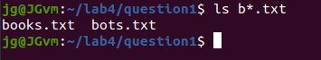
**Problem 3:**<br>
What if you want to list all the `css` and `html` files in `~/lab4/question1`? How would you do that?
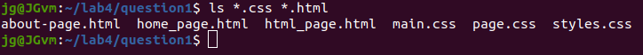
**Problem 4:**<br> 
Let’s you want to know the size of all files that have a particular word in the file name. In this case, you do not remember the file extension or the beginning of the filenames. The only thing you know is that they have the word `page` in the file name. How do you do that? 
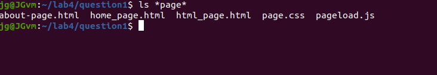
**Problem 5:**<br>
What if you want to move a bunch of files from 1 directory to another. For example, the `~/lab4/question1` directory has a lot of files. Create a directory for each file type and then move the files in bulk to their respective directories. 

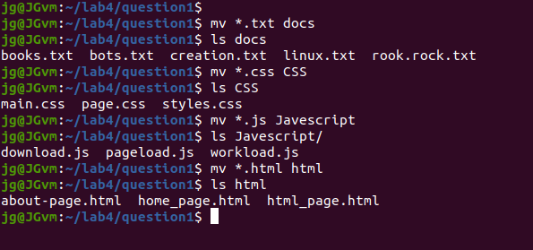


## Question 2 | Using the ? wildcard
In the previous questions, we learned how to match multiple characters in a filename. Now, what happens when we want to match a specific number of characters. The following scenarios explore the use of the `?` wildcard for matching a given number of characters.

**Problem 1:**<br>
You want to move the following `xml` files to the `xmlfilesles` directory: `bad.xml`, `bid.xml`, and `bed.xml`. Notice that these files have multiple things in common. For instance they all start with `lowercase b` and end in `d.xml`. We can use the ? wildcard to move all these files in a single command. Notice that using the star wildcard like this: `*.xml` will not work since there are other xml files in the current directory and we do not wish to move them. **How can we do this then?** Use the `~/lab4/question2` directory to solve this problem
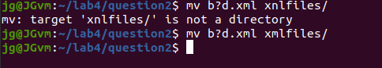
**Problem 2:**<br>
The ? wildcard is also useful when we want to work with hidden files. Remember that in linux, hidden files have a `.` at the beginning of the filename. Now, you may be wondering, **can I do the same thing with the * wildcard?** Well, NO! In Linux the present working directory and its parent directory have a name. The present working directory is represented by a single period and the parent directory is represented by two periods. For instance if you use the `ls -a` command to list all the files in your present working directory, notice that the first two entries are `.` and `..`

So if you were to list all the hidden files in a given directory, `ls -a .*` will not work as expected since the present working directory will also be listed. To solve this bug-turn-into-feature problem, we can use the `.??*` wildcard. You can also use: `./.*` for the present working directory or `../.*` for the parent directory. Now to put this into practice, list all the hidden files inside the `~/lab4/question2` directory. 

**Problem 3:**<br>
Since the `?` wildcard matches only 1 character, we can use multiple `?` to match multiple characters. For instance, how do you list all the files in a given directory that have a 4 letters in their respective file extension?
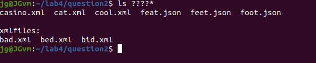
**Problem 4:**<br> 
Lets see another example, try to list all the files that have two letters between letter `f` and letter `t`. Try to do this one on your own!

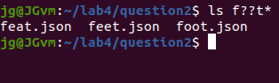


## Question 3 | Using the [] Wildcard
In the previous question we learned how to match a single or a given number of characters in a filename. Now, sometimes you want to match a range of characters. For example, all the files that start with a capital letter or a digit. This is possible with the `[]` wildcard which matches the range specified inside the `[]`. Use the `~/lab4/question3` directory to solve this question.

**Problem 1:**<br>
You want to list all the hidden python files that start with a lowercase letter. **How would you do that?**
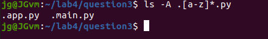
**Problem 2:**<br>
You want to list all the files that start with an uppercase letter, are followed by a lowercase letter, and have a number before the file extension. How would you do that?
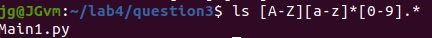
**Problem 3:**<br>
You want to list all the files that start with letters a-d or e-k and have a two letter file extension. How would you do that?
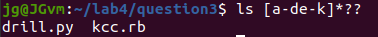
**Problem 4:**<br>
You want to list all the files that do not start with capital letters and do not have a number before the file extension. 


## Question 4 | Using brace expansion. 
The curly braces are not a wildcard but they are equally useful. The curly braces allow you to generate arbitrary strings to use with commands. 

**Problem 1:**<br>
In the question4 directory, create the following directory structure. Display a tree of the directory once you have created. Your directory tree must look exactly like mine. Take a screenshot:
```
wallpapers/
├── cars
│   ├── 1080p
│   ├── 2k
│   └── 4k
└── ocean
    ├── 1080p
    ├── 2k
    └── 4k
```
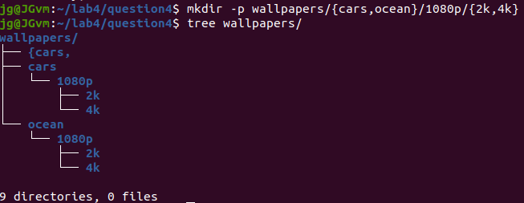
**Problem 2:**<br>
Clear your terminal. in the question4 directory, create the following directory structure. Display a tree of the directory once you have created. Your directory tree must look exactly like mine. Take a screenshot:
```
assets/
├── imgs
│   ├── large
│   │   └── source
│   └── small
│       └── source
└── video
    ├── large
    │   └── source
    └── small
        └── source
```
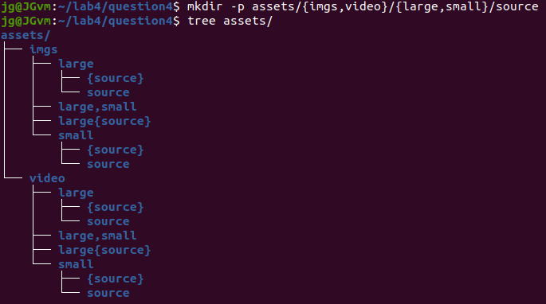
**Problem 3:**<br>
Clear your terminal. in the question4 directory, create the following directory structure. Display a tree of the directory once you have created. Your directory tree must look exactly like mine. Take a screenshot:
```
docs/
├── books
│   ├── history
│   ├── math
│   ├── science
│   └── social
└── research
    ├── history
    ├── math
    ├── science
    └── social
```
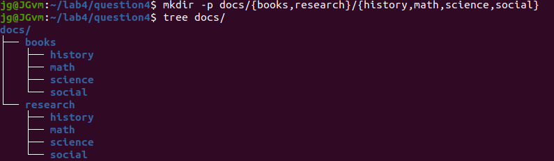
**Problem 4:**<br>nt working directory.

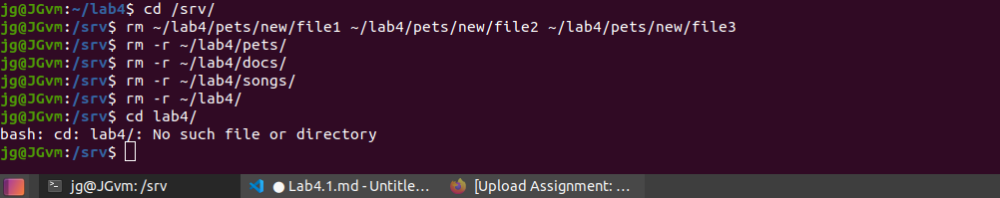


# Question 3: Moving Files and Directories
1. Make sure that you are working on your home directory. Run the following command: `wget https://robertalberto.com/public/lab4.zip && unzip lab4.zip && rm lab4.zip`
2. In your home directory, create the following directories: `lab4-imgs`, `lab4-audio`, `lab4-video`, `lab4-docs`
3. Move all the files inside the lab4 directory to their respective new directories in your home directory. 
4. Inside the  `lab4` directory, you will find a directory called `Wallpaperlab4`. Move this directory to your `Pictures` directory and rename it to `NewWallpapers`.
5. Rename the `lab4` directory to `Lab-4`.

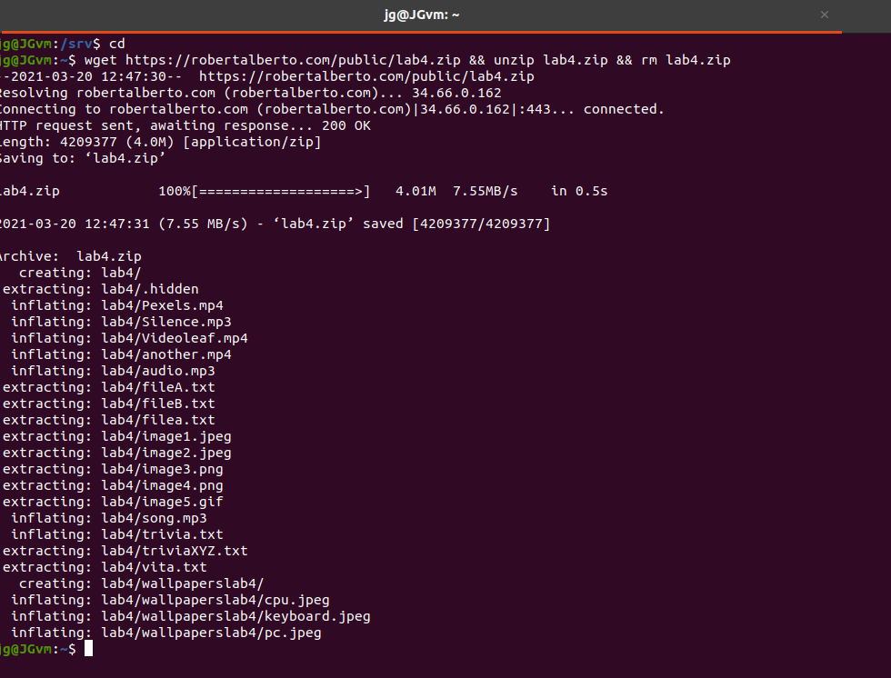
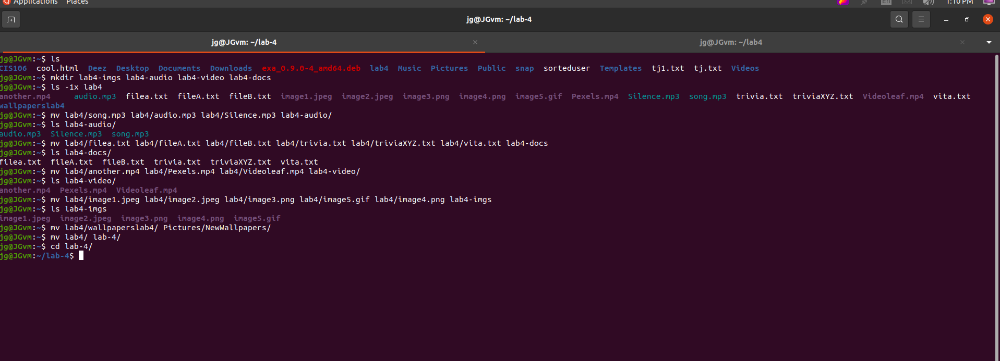


# Question 4: Copying Files and Directories
1. Go to [pexels.com](https://www.pexels.com/search/HD%20wallpaper/). Download at least 3 wallpapers.
2. Copy the wallpapers to your `Pictures/NewWallpapers` directory. 
3. Create a new directory in your Downloads directory (use whatever naming convention you want). Download 3 wallpapers and move them to your new directory.
4. Copy your new directory to the Pictures directory.
5. Remove the new directory in your Downloads directory.

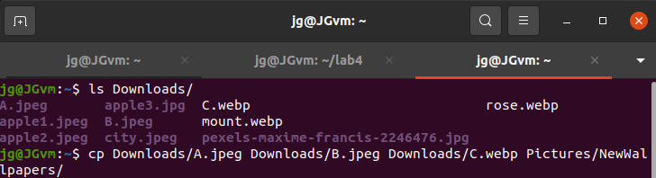

**Problem 5**<br>
Clear your terminal. in the question4 directory, create the following directory structure. Display a tree of the directory once you have created. Your directory tree must look exactly like mine. Take a screenshot:
```
backup/
├── files
│   ├── personal
│   │   ├── feb
│   │   ├── jan
│   │   └── mar
│   ├── programs
│   │   ├── feb
│   │   ├── jan
│   │   └── mar
│   └── school
│       ├── feb
│       ├── jan
│       └── mar
├── images
│   ├── cars
│   │   ├── high
│   │   └── low
│   ├── classic
│   │   ├── high
│   │   └── low
│   ├── panorama
│   │   ├── high
│   │   └── low
│   └── world
│       ├── high
│       └── low
└── random
```